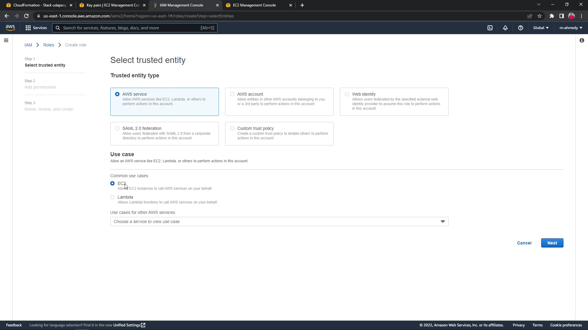
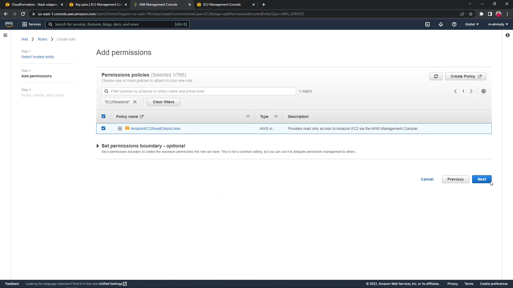
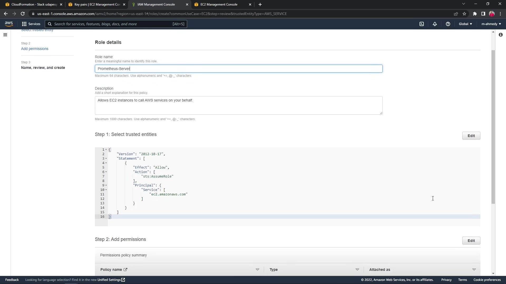
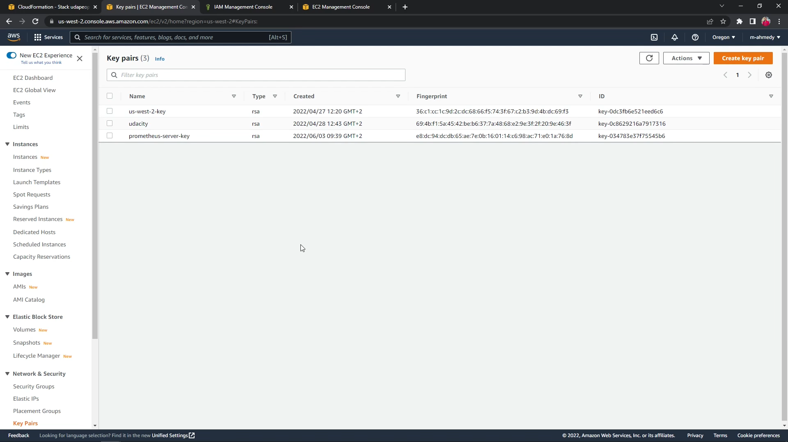
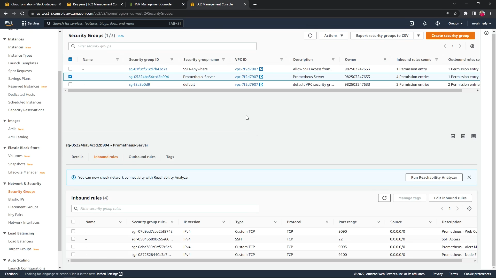
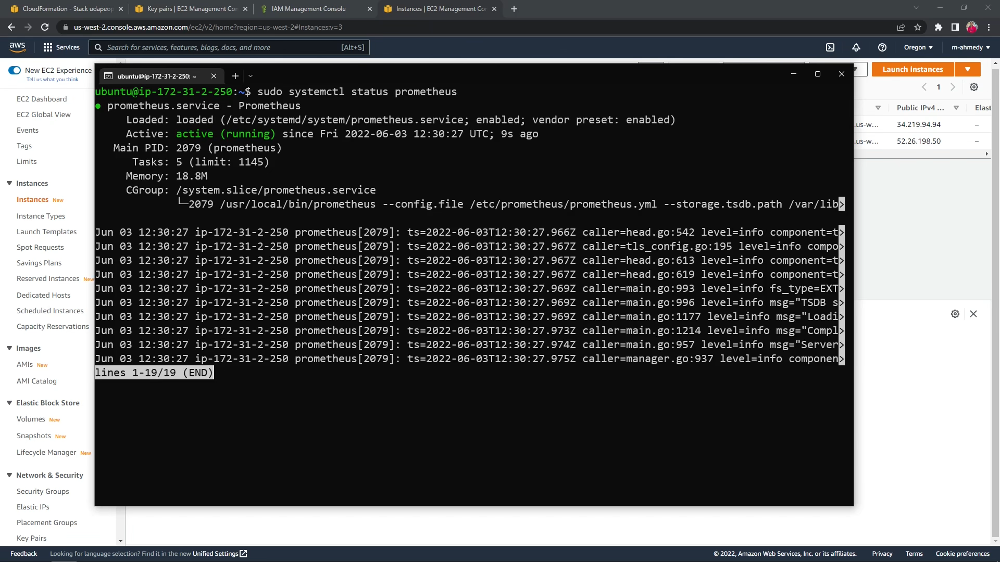
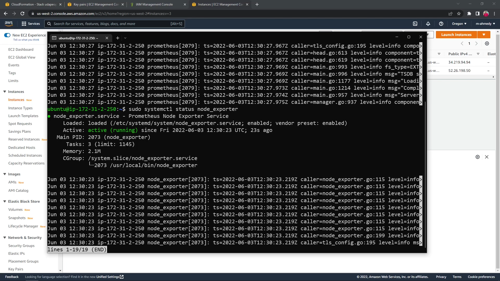
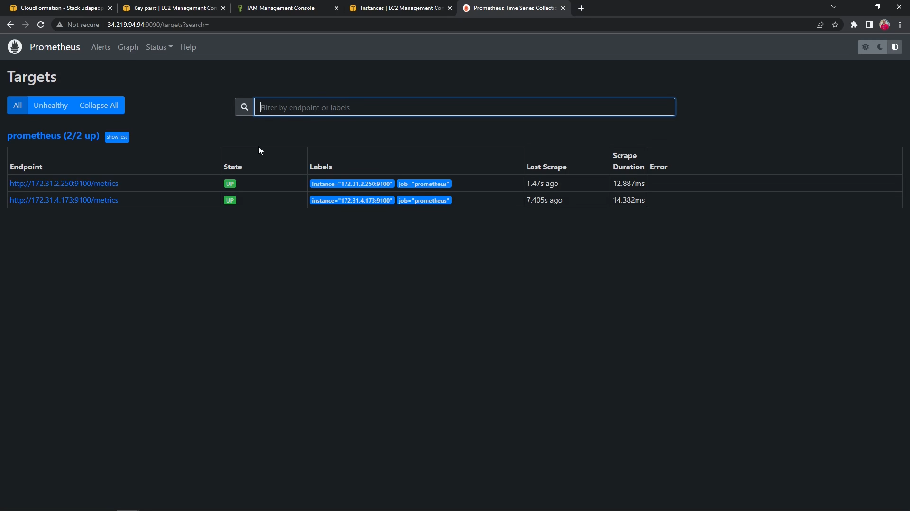
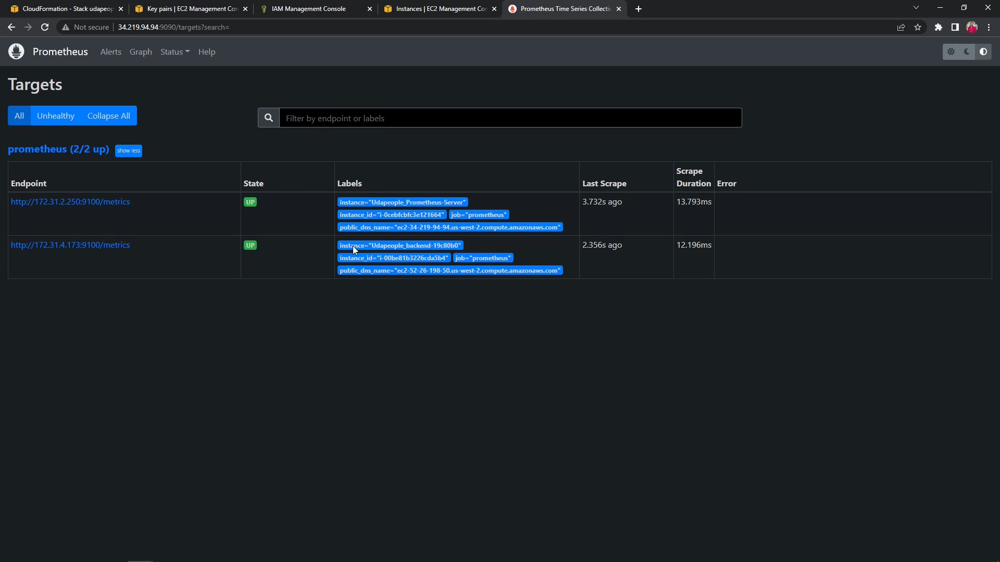

# Part 16 - Monitoring with Prometheus

In this section we begin setting up a monitoring service with Prometheus, the following guide is mainly a culmination of the excellent Prometheus guides by [Héctor Rosales](https://codewizardly.com/authors/hector/)

## Objectives

- Create Prometheus server to collect logs from the backend instance
- We will mainly use the guides provided by the Project instructions with a few minor differences
  - We will be using the latest versions of Prometheus Tools (Prometheus, Alert Manager, Node Exporter) to ensure compatibility
  - We will be using an IAM Role instead of a IAM User, and attach this Role to the Prometheus Server Instance
  - We will extend our config to contain more valuable information

## Prerequisites

### Updates to the Backend template

- Open Inbound Traffic on port 9100 for the Node Exporter Service
- Add a Project Tag to help us with filtering on Prometheus

`.circleci/files/backend.yml`

```yml
Resources:
  InstanceSecurityGroup:
    Type: AWS::EC2::SecurityGroup
    Properties:
      ...
      SecurityGroupIngress:
        ...
        - IpProtocol: tcp
          FromPort: 9100
          ToPort: 9100
          CidrIp: 0.0.0.0/0

  EC2Instance:
    Type: AWS::EC2::Instance
    Properties:
      ...
      Tags:
        - Key: Name
          Value: !Sub backend-${ID}
        - Key: Project
          Value: Udapeople
  ...
```

### Create an IAM Role for EC2 Service Discovery

The Role will be assumed by the **EC2 Service** and has the permissions of the **AmazonEC2ReadOnlyAccess** policy

- EC2 Service

  

- EC2ReadOnly

  

- Review

  

### Create a Key Pair for Prometheus

A key pair should be present to connect to the Prometheus Server Instance



### Create a Security Group allowing the necessary ports

The open ports needed for the Prometheus Server

- 22/tcp for SSH Access
- 9090/tcp for Prometheus Web Console
- 9093/tcp for Prometheus Alert Manager
- 9100/tcp for Prometheus Node Exporter



## Implementation

### Instance Configuration

The settings required for the Prometheus Server instance will be:

- AMI: Ubuntu Server 22.04 LTS
- Security Group allowing traffic on TCP ports 22, 9090, 9093, and 9100 (created previously)
- On additional configuration attach the IAM role to the instance

### Check permissions

Connect to the Server instance with SSH and check IAM permissions

```sh
# Install AWS CLI v2
sudo apt update && sudo apt install unzip -y
curl "https://awscli.amazonaws.com/awscli-exe-linux-x86_64.zip" -o "awscliv2.zip"
unzip awscliv2.zip
sudo ./aws/install -y

# Check the permissions
aws sts get-caller-identity
```

The output should be of the following format

```json
{
  "UserId": "ABCDEFGHIJKLMNOPQRSTU:i-xxxxxxxxxx",
  "Account": "123456789123",
  "Arn": "arn:aws:iam::123456789123:assumed-role/Prometheus-Server/i-xxxxxxxxxx"
}
```

The output indicates that the server instance can communicate with the AWS API using the credentials attached to it via the IAM Role

### Installing Prometheus

First in order to safely use Prometheus and Node Exporter, we shall create separate users for them

```sh
sudo useradd --no-create-home prometheus
```

Create library and config folders

```sh
sudo mkdir /etc/prometheus
sudo mkdir /var/lib/prometheus
```

Get the latest Prometheus binaries, at the time of writing the latest version of Prometheus is 2.41.0

```sh
wget https://github.com/prometheus/prometheus/releases/download/v2.41.0/prometheus-2.41.0.linux-amd64.tar.gz
```

Then extract the tarball

```sh
tar xvfz prometheus-2.41.0.linux-amd64.tar.gz
```

Copy the files to their destinations

```sh
sudo cp prometheus-2.41.0.linux-amd64/prometheus /usr/local/bin
sudo cp prometheus-2.41.0.linux-amd64/promtool /usr/local/bin/
sudo cp -r prometheus-2.41.0.linux-amd64/consoles /etc/prometheus
sudo cp -r prometheus-2.41.0.linux-amd64/console_libraries /etc/prometheus
```

Now you can remove the tarball

```sh
rm -rf prometheus-2.41.0.linux-amd64.tar.gz prometheus-2.41.0.linux-amd64
```

### Installing Node Exporter

The same steps can be applied for installing Node Exporter on the Prometheus Server instance

```sh
sudo useradd --no-create-home node_exporter

wget https://github.com/prometheus/node_exporter/releases/download/v1.5.0/node_exporter-1.5.0.linux-amd64.tar.gz

tar xzf node_exporter-1.5.0.linux-amd64.tar.gz

sudo cp node_exporter-1.5.0.linux-amd64/node_exporter /usr/local/bin/node_exporter

rm -rf node_exporter-1.5.0.linux-amd64.tar.gz node_exporter-1.5.0.linux-amd64
```

### Create initial Prometheus config

```sh
sudo nano /etc/prometheus/prometheus.yml
```

Use the following configuration

```yml
global:
  scrape_interval: 15s
  external_labels:
    monitor: "prometheus"

scrape_configs:
  - job_name: "prometheus"
    ec2_sd_configs:
      - region: us-west-2
        port: 9100
        filters:
          - name: tag:Project
            values: [Udapeople]
```

### Create systemd services for Prometheus and Node Exporter

**Prometheus Service**

```sh
sudo nano /etc/systemd/system/prometheus.service
```

```
[Unit]
Description=Prometheus
Wants=network-online.target
After=network-online.target

[Service]
User=prometheus
Group=prometheus
Type=simple
ExecStart=/usr/local/bin/prometheus \
 --config.file /etc/prometheus/prometheus.yml \
 --storage.tsdb.path /var/lib/prometheus/ \
 --web.console.templates=/etc/prometheus/consoles \
 --web.console.libraries=/etc/prometheus/console_libraries

[Install]
WantedBy=multi-user.target
```

**Node Exporter Service**

```sh
sudo nano /etc/systemd/system/node_exporter.service
```

```
[Unit]
Description=Prometheus Node Exporter Service
After=network.target

[Service]
User=node_exporter
Group=node_exporter
Type=simple
ExecStart=/usr/local/bin/node_exporter

[Install]
WantedBy=multi-user.target
```

### Update the permissions for application files

```sh
sudo chown prometheus:prometheus /etc/prometheus
sudo chown prometheus:prometheus /usr/local/bin/prometheus
sudo chown prometheus:prometheus /usr/local/bin/promtool
sudo chown -R prometheus:prometheus /etc/prometheus/consoles
sudo chown -R prometheus:prometheus /etc/prometheus/console_libraries
sudo chown -R prometheus:prometheus /var/lib/prometheus
```

### Run the services

```sh
sudo systemctl daemon-reload

sudo systemctl enable node_exporter
sudo systemctl enable prometheus

sudo systemctl start node_exporter
sudo systemctl start prometheus
```

### Check Services

```sh
sudo systemctl status node_exporter
sudo systemctl status prometheus
```

The output of the previous command should indicate that the services are up and running





## Checking the Web Portal

After making sure that both services are up and running we can check the Prometheus web portal

The portal is hosted on Port 9090 by default

Switch to the Targets tab to see active targets



## Improving the labels

We can use relabeling feature in Prometheus to

- Configure a new "instance" label be the combination "Project" and "Name" tags value of the instances
- Extract the Public DNS Name and Instance ID to use later in alerting

So updating Prometheus configuration to improve labels

`/etc/prometheus/prometheus.yml`

```yml
global:
  scrape_interval: 15s
  external_labels:
    monitor: "prometheus"

scrape_configs:
  - job_name: "prometheus"
    ec2_sd_configs:
      - region: us-west-2
        port: 9100
        filters:
          - name: tag:Project
            values: [Udapeople]
    relabel_configs:
      - source_labels: [__meta_ec2_tag_Project, __meta_ec2_tag_Name]
        separator: "_"
        target_label: instance
      - source_labels: [__meta_ec2_instance_id]
        target_label: instance_id
      - source_labels: [__meta_ec2_public_dns_name]
        target_label: public_dns_name
```

Then restart the service

```sh
sudo systemctl restart prometheus.service
```

Now if we check the Targets tab on the Web Portal we shall see the new labels



This way we can identify targets more clearly as the new **instance** label will be of the **`Udapeople_backend-xxxxxxx`** format

---

Now we can implement monitoring queries and alerting in the next part
